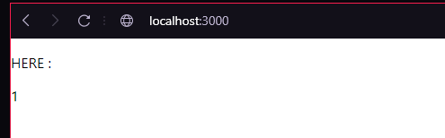
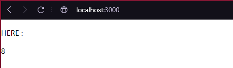

# BigDataApplication_Nodejs

## Technologies
The different technologies we used were:
- React
- Docker
- Jenkins

## Goal
The goal was to create an app with backend and frontend which returns the number of time the page is loaded (in localhost).

The counter was set in our backend while we displayed the result in our frontend. 

## The result
The final result is not really aesthetic, but it works well.

Local page run (frontend):

Local page rerun 7 times:

